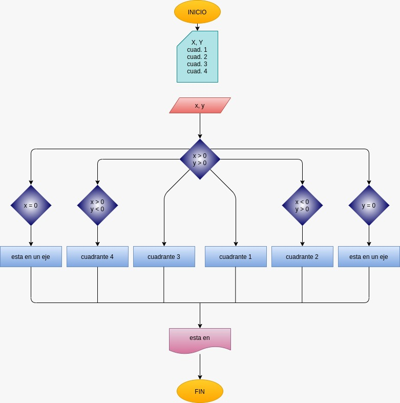

# EJERCICIO 3 ESTRUCTURAS CONDICIONALES

## Programa que lea las cordenadas cartesianas (x,y) de un punto en el plano y calcule el cuadrante al cual pertenece el punto

## ANALISIS

### Definición de variables

x = cordenada x
y = cordenada y 
cua1
cua2
cua3
cua4

## DISEÑO

