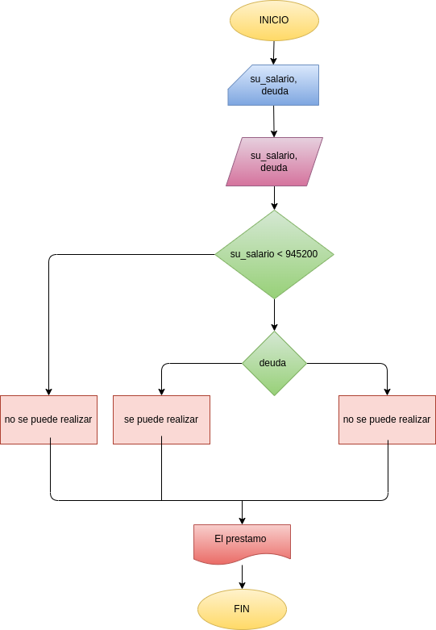

# EJERCICO 4 ESTRUCTURAS CONDICIONALES

## Programa para reaizar prestamo bancario a personas con salario mayor a $945200

## ANALISIS

### Definicion de variables  

su_salario: cual es su salario
deuda: se pregunta si la persona tiene alguna deuda con la entidad bancaria
prestamo: dice si, si se puede realizar el prestamo o no

## DISEÑO

